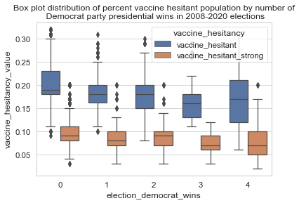
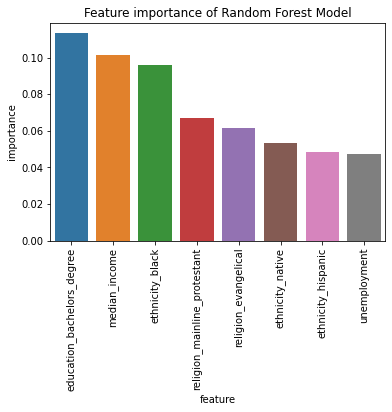

# Analyzing determinants of COVID-19 vaccine hesitancy

### Business Problem, Opportunity, and Impact

### Overview of industry, business, or problem

Covid-19 has overturned the world, forcing countries globally to enact lockdown measures to keep high caseloads from overwhelming healthcare systems. The rapid development of the vaccine was seen as a light out of the tunnel and an end to the pandemic. Underlying this vision was the concept of “herd immunity” which requires a large enough part of the population to be vaccinated, rendering transmission of the virus unlikely. The figures for herd immunity vary (from 70-90% [[1]](https://www.webmd.com/vaccines/covid-19-vaccine/news/20210414/faq-herd-immunity-and-covid-19) but recent reports from scientists are warning that herd immunity likely won’t ever be achieved due to vaccine hesitancy among certain segments of the population [[2]](https://www.nytimes.com/2021/05/03/health/covid-herd-immunity-vaccine.html). Our project will be looking at that segment to understand what factors play into vaccine hesitancy and how vaccine rollout policies can be developed with them in mind to ensure healthcare outcomes like herd immunity are actually met.

### Define the specific problem that should be solved

What are the determinants and key factors that play into COVID-19 vaccine hesitancy across the American population?

We plan on approaching this question through a few lenses.

* One is through identity based categories via census and self-reported data:
    * ethnicity/race
    * socioeconomic factors (education level attainment, poverty rate, median income, unemployment)
    * political orientation
    * birth rate
    * religiosity
    * and other datasets as they become available
* Secondly, we plan on looking at the impact of social media on vaccine hesitancy by analyzing public Twitter data for vaccine hesitancy.

Due to resourcing constraints, we rescoped our project to focus solely on the first lens of looking at demographic data and shelved our Twitter component.

### Why does this problem matter?

Creating effective healthcare policies requires a deep understanding of patient mindsets, health inequities and the impact of external parties on healthcare messaging. Without a strong understanding of where, why and who these people that are hesitant to vaccines are, herd immunity will be an impossible task to achieve.

### Potential Audience

We imagine that healthcare workers, policy makers and all levels of government would be interested in such an analysis and data to better inform their work. A strong facility of determinants of vaccine hesitancy would give them a better toolkit for combating it along all levels of patient interactions (doctors in vaccine hesitant towns to federal healthcare policy makers allocating vaccine distribution). A predictive model of vaccine hesitancy based on publicly available data would be a great aid to the stakeholders mentioned above if there was ever another pandemic. It would allow them to target and allocate resources more efficiently.

## [Datasets](https://github.com/kuruparans/covid19-vaccine-hesitancy-analysis/tree/main/datasets)

We source a variety of datasets mainly from governmental official sources. Our primary dataset is a vaccine hesitancy dataset that provides us with estimated vaccine hesitancy of each county. We couple this with a variety of census datasets from employment rates to natality.

### Vaccine Hesitancy

Data about vaccine hesitancy coupled with social demographics (ethnic composition) and index tracking social vulnerability and vaccine availability throughout the counties of the United States. Vaccine hesitancy is estimated using Census Bureau’s Household Pulse Survey (HPS) during March 3, 2021 – March 15, 2021. Demographics are modeled using 2019 census bureau. ~3100 rows & 14 columns. Size: 157 MB. Source: [Centers for Disease Control and Prevention](https://data.cdc.gov/Vaccinations/Vaccine-Hesitancy-for-COVID-19-County-and-local-es/q9mh-h2tw).

### Poverty

Data about poverty estimates throughout the counties of the United States. Estimates are modeled using the 2019 census bureau. ~79900 rows & 4 columns. Size: 2 MB. Source: [USDA Economic Research Service](https://www.ers.usda.gov/data-products/county-level-data-sets/download-data/).

### Unemployment

Data about unemployment estimates along with other economic stats like median household income throughout the counties of the United States. Estimates are modeled using the 2019 census bureau. ~79900 rows & 4 columns. Size: 2 MB. Source: [USDA Economic Research Service](https://www.ers.usda.gov/data-products/county-level-data-sets/download-data/).

### Education

Data about educational attainment estimates along with other stats throughout the counties of the United States. Estimates are modeled using the 2019 census bureau. ~79900 rows & 6 columns. Size: 1 MB. Source: [USDA Economic Research Service](https://www.ers.usda.gov/data-products/county-level-data-sets/download-data/).

### Religion

Data about religious congregations and estimates of adherents for various groups and churches throughout the counties of the United States. Estimates are modeled using the 2010 census bureau data and surveys. ~3100 rows & 9 columns. Size: 2 MB. Source: [The Association of Religion Data Archives](https://www.thearda.com/Archive/Files/Descriptions/RCMSCY10.asp).

### Natality

Data about population and birth rates throughout the counties of the United States. Estimates are modeled for 2016-2019 using the census bureau data and surveys. ~3100 rows & 3 columns. Size: 1 MB. Source: [Centers for Disease Control and Prevention](https://wonder.cdc.gov/natality.html).

### Political

Data about American presidential election results throughout the counties of the United States. ~3100 rows & 4 columns. Size: 1 MB. Source: [Tony McGovern (Github)](https://github.com/tonmcg/US_County_Level_Election_Results_08-20).

## [Data Cleaning](https://github.com/kuruparans/covid19-vaccine-hesitancy-analysis/blob/main/data-cleaning.ipynb)

### Approach

We want to clean and combine all of our various datasets and export it as one CSV. This will primarily involve dropping columns that we aren't interested in and merging onto a central Pandas DataFrame. After some exploratory analysis, we will determine what rows will need to be dropped or interpolated. Our primary key for all these datasets that we will be merging on after cleaning is the FIPS code, a unique integer value representing each county/state.

#### County Info

The vaccine hesitancy dataset has values for multiple segments (ethnicity, social vulnerability, vaccine hesitancy), which we will split out into separate variables and look at each. Our primary index of county codes is given by Federal Information Processing Standards (FIPS), which we extract with useful identifiers of the county (its name and state). For additional avenues for data exploration, we add in the census defined region and division values for each county.

#### Ethnicity

Percentages of ethnicity for each county are given. For readability and simplicity, we rename them with the most abundant ethnic group as primary and assume non-Hispanic for all of the non-Hispanic groups.

#### Education

We keep four columns from the education dataset representing the percentage of the entire adult population with specific educational attainment signifiers (less than high school degree, high school diploma only, some post-secondary degree, completion of bachelor's degree) and make sure to represent all the percentages as decimal values.

#### Poverty

From the Poverty Estimate dataset, we keep the column of values for the percentage of the entire population that is in poverty in 2019. The data is in a narrow format, so we use pivot and make sure to represent the percentage as a decimal.

#### Elections

The original election dataset is given as Democrat, Republican and Other votes for each presidential election from 2008 to 2020. We simplify this data into something easier for us to analyze by finding the number of times the Democrat party has won in the past four presidential elections and similarly for the Republican party. This gives a sense of the political leaning for each county.

#### Unemployment

From the Unemployment dataset, we have several useful data points involving geography (rural vs urban continuum code, urban influence code), income (median household, and represented as a percent of median state total) and unemployment rate.

#### Income

To look at the county's economic factors, we keep two columns representing the estimated median household income in 2019 and the county household median income as a percent of the state total median household income. We represent this percent as a decimal.

### Data Completeness

During our data cleaning, we noticed a recurring pattern of certain counties being missing in most of our datasets.

* Oglala Lakota County, South Dakota (FIPS 46102)
* Kalawao County, Hawaii (FIPS 15005)
* Various parts of Alaska, especially in the election dataset

Upon further investigation into those areas, we learned that Oglala Lakota County does not have a functioning county seat and remains unorganized, which explains the difficulty government surveyors would have with gathering data there. However, this county is entirely on an Indian reservation, which would give us valuable insight on Native American vaccine hesitancy.

Kalawao County because of its small population does not have many of the functions that a normal county would have.

While Alaska does administer using county divisions, for elections they use a different geographic boundary of boroughs, which do not conveniently align with counties. This makes a county level political correlation with vaccine hesitancy impossible for us. Similar to the note above, Alaska is home to a lot of Native Americans, 15% of the population, which means our analysis will lose insight into Native American vaccine hesitancy.

Because of the issues surrounding population size, county organization and governmental issues, we decided to drop those two data points and focus our analysis on the central parts of the USA, ignoring Alaska.

### Data Aggregation

We set the fips as index for all of our data frames and then concatenate them along it with an inner join.

## [Exploratory Data Analysis](https://github.com/kuruparans/covid19-vaccine-hesitancy-analysis/blob/main/exploratory-data-analysis.ipynb)

Now that we have got our data accessible, all in one convenient wide-format dataframe, we can begin to analyze our data using visualization tools like histograms, box plots and scatterplots to determine qualitatively about relationships between these different variables. We confirm our hypotheses with standard ANOVA tests to determine that the mean variability is not statistically insignificant and then apply T-test and pairwise tukey tests to assess if the relationship between our demographic variable and vaccine hesitancy is statistically significant.

Please note that all of our percent rates for vaccine hesitancy, poverty rate, ethnicity composition etc are all expressed as decimal values in our charts. 

### Vaccine Hesitancy

The vaccine hesitant population is distributed almost normally with a very small right skew, however that isn't too significant. There are slightly more outliers on the less hesitant side than the very hesitant side.

The strongly vaccine hesitant distribution is also normally distributed, but seemingly less so this time. The distribution has a slight right skew. There are more outliers on the hesitant side than there are on the less hesitant (the opposite of the last vaccine_hesitant distribution).

### Ethnicity

Our ethnicity plots don't show a strong relationship between vaccine hesitancy and county ethnic composition. It's difficult to tell in some cases because of the low minority population in many counties, which tend to show a plot clustered around the y-axis.

* Hispanic - plots show an almost 2D bell curve distribution with a normal at 18% vaccine hesitant and 9% strongly vaccine hesitant. Both of these figures are similar to the overall total vaccine hesitant distributions above.
* Native - counties with higher Native populations seem to be more highly vaccine hesitant. However the vast majority of counties have a very small Native population, which is somewhat normally distributed along vaccine hesitancy.
* Asian - counties with higher Asian populations tend to be less vaccine hesitant and strongly vaccine hesitant.
* Black - counties with higher Black populations seem to have a higher percent of vaccine hesitant, but not strongly vaccine hesitant populations.
* Hawaiian - counties with a larger Hawaiian composition tend to be evenly distributed along vaccine hesitancy except for a small modal bump at a very low vaccine hesitancy of 10% and strongly vaccine hesitant 5%.
* White - the strongly vaccine hesitant white show a slight 2D bell curve distribution with a normal at 10% hesitancy. The vaccine hesitant graph doesn't show a clear relationship

Initially, we attempted to do ANOVA and Tukey t-tests however because the dependent variable is not simply clustered into groups of ethnicities but instead groups of ethnicities with an independent variable of the percent of ethnicity, we instead just looked at the correlation between the factors. 

When we do Pearson correlation tests on each ethnicity, we find that the white category is statistically insignificant, while the others are. There seems to be a moderate and strong negative correlation with Hispanic (-0.21) and Asian (-0.35) groups, while Black (0.27) and Native (0.16) have a strong and moderate positive correlation with vaccine hesitancy.

### Geography

#### Region

We look at the vaccine hesitant and strongly vaccine hesitant populations by census region. The South and Midwest have a highly differentiated distribution of the two variables with little overlap. The West and Northeast have much more of an overlap. This may suggest that opinion on vaccine hesitancy may be more polarized in the South and Midwest.

Our ANOVA tests of vaccine hesitancy (both types) indicate a statistically significant difference between the regional groups. Running pairwise Tukey t-tests, as well, shows that most of the differences between regions are statistically significant (apart from Midwest and West, possibly indicating cultural similarity between the two on this topic).

#### Division

We look at the vaccine hesitant and strongly vaccine hesitant populations by census division. Similar to the regional analysis, Southern region divisions (East South Central, West South Central and South Atlantic Division) show a highly differentiated distribution of the two variables with little overlap. Midwest divisions like West North Central and The west and northeast have much more of an overlap. This may suggest that opinion on vaccine hesitancy may be more polarized in the South and Midwest.

Our ANOVA tests of vaccine hesitancy (both types) indicate a statistically significant difference between the division groups.

#### State

We look at the vaccine hesitant and strongly vaccine hesitant populations by state. 

Our ANOVA tests of vaccine hesitancy (both types) indicate a statistically significant difference between the different states.

#### Rural Urban Code

The rural urban code reflects a categorization of each county along a 1-9 integer scale from very urban (1) to very rural (9) by census geographers.

We see a slight increase in vaccine hesitant and strongly vaccine hesitant populations with an increase in the rural urban code. This suggests that more rural counties may have higher vaccine hesitant populations.

Our ANOVA tests of vaccine hesitancy (both types) indicate a statistically significant difference between the rural-urban codes. When doing pairwise Tukey t-tests, we see that there are statistically significant differences between rural urban codes that are far apart (3+) like counties of code 3 vs 6, but codes that are close together like 8 vs 9 are not statistically significant.

#### Urban Influence Code

The urban influence code reflects a categorization of each county along a 1-2 integer scale from strong urban/metropolitan development to very little urban/metropolitan development (12) by census geographers.

We see a slight increase in vaccine hesitant and strongly vaccine hesitant populations with an increase in the urban influence code. This suggests that less urban developed counties may have higher vaccine hesitant populations.

Our ANOVA tests of vaccine hesitancy (both types) indicates a statistically significant difference between the rural-urban codes. Similar to above, when doing pairwise Tukey t-tests, we see that there are statistically significant differences between urban influence codes that are far apart vs close together.

### Birth Rate

We see a slight positive relationship between vaccine hesitancy and birth rate, however it isn’t as strong as we had expected, however when doing t-tests, we do see that the relationship is statistically significant. The Pearson correlation factor for it is 0.14.

### Economic

#### Median Income

We see a moderately strong negative relationship between median county income and vaccine hesitancy. This was confirmed as statistically significant with a t-test. This was the most obvious relationship in our dataset, however the Pearson correlation factor was -0.46, one of the strongest in our dataset.

This finding suggests that less wealthy counties may have higher vaccine hesitancy.

#### Unemployment

We see a slight positive relationship between county unemployment rate and vaccine hesitancy. This was confirmed as statistically significant with a t-test. The Pearson correlation factor is only 0.15.

This suggests that counties with higher unemployment rate may have slightly higher vaccine hesitancy.

#### Poverty

We see a moderately strong positive relationship between county poverty rate and vaccine hesitancy. This was confirmed as statistically significant with a t-test. The Pearson 0.41 correlation factor is 0.41, one of the highest of our dataset.

This suggests that counties with a high poverty rate may have higher vaccine hesitancy, which relates with our prior median income analysis.

#### Education

* For the two plots for less than high school education, we see a slight linear relationship between vaccine hesitancy and increase of percent of less than high school education population.
* This relationship weakens with the more educated high school graduate only plots.
* The some post-secondary degree group does not have a significant relationship.
* The bachelors degree and higher graphs show an inverse relationship between the amount of population with a bachelors degree and vaccine hesitancy.

When we calculate Pearson correlation coefficients, we find the some bachelor degree group is statistically insignificant, while the others are. Interestingly, the high school only (0.35) was more positively correlated than the less than high school (0.28) group, while the bachelor’s degree group (-0.43) was strongly negatively correlated with vaccine hesitancy.

In general, we see a trend of more education decreasing vaccine hesitancy.

### Religion

Our hypothesis going into this was religiosity had an effect on vaccine hesitancy, however these graphs don't show as strong a relationship as expected.

* Total religious adherents doesn't seem to have a relationship with vaccine hesitancy
* Evangelical adherents numbers have a slight uptake as vaccine hesitancy increases but then does not increase much after the mean.
* Mainline protestant adherents has a slight bell curve distribution with some concentration on the upper end of vaccine hesitancy, however not very strongly.

We calculate Pearson correlation coefficients, we find that the mainline protestant group is statistically insignificant, while the others are significant. The total religious adherents has a very small positive correlation (0.08), while the evangelical group has a strong (0.30) positive correlation with vaccine hesitancy. While mainline protestant was statistically insignificant, it had a negative coefficient, which paired with the total religious adherent finding, tells us that religion as a whole doesn’t imply vaccine hesitancy, but specific ones that are anti-vaxx.

### Politics

As the number of Democrat party presidential wins in 2008-2020 elections increase, we see a slight decrease in both vaccine hesitant and strongly vaccine hesitant populations. The last box plot with 4 Democrat wins is a bit of an outlier since vaccine hesitancy increases a bit, however the variance, shown by the whiskers, of the population is much larger.

When we calculate the Pearson correlation coefficient, we find that the correlation is a bit stronger at -0.27 for number Democrat wins and vaccine hesitancy.

## [Statistical Modelling](https://github.com/kuruparans/covid19-vaccine-hesitancy-analysis/blob/main/statistical-modelling.ipynb)

Along with understanding the social determinants of vaccine hesitancy, we are interested in seeing if we can better predict vaccine hesitancy using publicly available census data. We hope that such a model could be used in the unfortunate event of another future global pandemic.

Healthcare officials would be able to use our predictive models, update the demographic data using the most up to date census data and get a (hopefully) good prediction of where in America strong vaccine hesitancy is likely to occur and resource communications and relevant health policies accordingly.

### Preliminary Linear Modelling

#### Assessing normality

To begin with, we look at a simple linear model. After assessing whether our two dependent variables (vaccine_hesitant and vaccine_hesitant_strong) are normally distributed by plotting their q-q plots, we notice a slight fat tail with our strongly vaccine dependent.

We do a Box-Cox lambda transformation on them to explore further and see that the lambda of vaccine hesitant is 0.83, which is almost 1 indicating that the distribution is normal. However the strongly vaccine hesitant data gives a Box Cox lambda of 0.33.

Using the statsmodel module, we fitted our two dependent variables, Box Cox transformed and original. 

<table>
  <tr>
   <td>Dependent Variable
   </td>
   <td>Transformation
   </td>
   <td>R2 Value
   </td>
  </tr>
  <tr>
   <td>Vaccine Hesitant
   </td>
   <td>Original
   </td>
   <td>0.429
   </td>
  </tr>
  <tr>
   <td>Vaccine Hesitant
   </td>
   <td>Box Cox transformed
   </td>
   <td>0.437
   </td>
  </tr>
  <tr>
   <td>Strongly Vaccine Hesitant
   </td>
   <td>Original
   </td>
   <td>0.289
   </td>
  </tr>
  <tr>
   <td>Vaccine Hesitant
   </td>
   <td>Box Cox transformed
   </td>
   <td>0.293
   </td>
  </tr>
</table>

We see that the Box Cox transformation only provides us a marginal increase in R2 value. One of the underrated benefits of a linear regression is its interpretability. We can say the coefficients of the variable have such and such an increase on such and such amount of the dependent variable directly. For the loss of interpretability of the results, in this case it isn’t worth it to Box Cox transform our results.

Our strongly vaccine hesitant variable has a very poor fit. This population is more rarefied and as such more difficult to predict. For the purposes of our other modelling, we will stick with the vaccine_hesitant variable and attempt to better understand what are the predictors there.

### Further Modelling

We conducted further modelling in hopes that we could increase the accuracy and predictive power of our models. 

Using sklearn, we first ensure our data pipeline is ready for modelling by creating one-hot encoding for categorical data like ethnicity, rural urban code etc. Afterwards, we split the data into a test/train split ratio of 20:80. Then we scale and normalize the data.

On all of our models, we used the cross value score, using a negative mean absolute error as the scoring, as an initial assessment for each model. Afterwards, we test the model’s predictions on our test split.

### Linear Regression Model

We found that most of our variables ended up being statistically insignificant with our linear regression model. Most of our religion and education categories were insignificant, however the most educated bachelor’s group was negatively correlated with vaccine hesitancy. Our ethnicity variables were only strong for both black and native groups, which were positively correlated with vaccine hesitancy.

### Lasso Model

First we try a lasso model with the default alpha = 1 value. Since it isn't as good as our linear regression model, we then try out different alpha values to see if we can optimize our model better.

Given that our lasso model has the smallest error term at alpha = 0, the lasso model isn't a good fit for our data. An alpha = 0 lasso model is equivalent to ordinary least square and can be solved by the sklearn.LinearRegression model we used above.

Interestingly, our lasso model’s top features were the election results, which weren’t as heavily featured in our other models. We plan on testing out the Lasso model after we take out the election results from the dataset and seeing how the model fares.

### Random Forest Model

We note that the cross value score of our random forest model is the best thus far, so we proceed with further explorations of feature selection and ways to optimize and tune it.

With our random forest model, we see that similar to the linear regression that bachelor’s degree is a high predictor. Black and Native as well appear along with Hispanic. Our economic factors of median income and unemployment appear again.

We attempt to visualize our random tree forest model. First we plot out a full tree diagram of the first estimator branches. However this isn’t too useful and is visually overwhelming.

We then attempt to simplify the visualization by plotting out the first estimator branch and limiting the max depth. This shows us how at a high level the model works taking a look at first the bachelor’s degree and then splitting down to look at black and republican wins and on and on. This isn’t too intuitive and we suggest switching this from a regression to a classification problem by feature engineering categories of vaccine hesitancy (low, medium, high) and then predicting those values. Doing so will allow us to plot a ROC curve to better understand our model.

#### Tuning

We try to improve ouf random forest model by using GridSearchCV, which goes over every permutation of hyperparameter setting for the best model. However, after several hours of running the script we receive only a marginal improvement in RMSE. We then tried a RandomizedSearchCV, which provided a comparable RMSE value with only an hour run time.

## [Visual Dashboard](https://public.tableau.com/app/profile/kuruparan6571/viz/VaccineHesitancyWorkbook/Analysis)

We visualized our data using Tableau. We chose Tableau over Google Data Studio because the former could handle FIPS county level data easily, whereas Google Datastudio only could aggregate at the state level and above. We fed in our cleaned dataset that combines vaccine hesitancy and an assorted array of other demographic variables mentioned above. With that dataset, we create several visualizations of vaccine hesitancy against other variables and include a trendline to make each easy to read.

Our dashboard provides a high level overview of vaccine hesitancy and its relationship to demographic variables. This would be useful for policy makers who want to understand what are the key determinants of vaccine hesitancy.

On the first dashboard, we map out the relationship of vaccine hesitancy and many cultural factors such as ethnicity, politics, etc. And on the second dashboard, we provide a handy choropleth map of America and vaccine hesitancy, as well as vaccine hesitancy and its relationship with economic factors like poverty, unemployment and median income.

On the other dashboards, we showcase at a glance region, state and county details of vaccine hesitancy and the demographics of that geographic area. We imagine this more relevant to state and county level officials who want a better understanding of their geographic area.

## Conclusions

### Insights and recommendations

#### Economic factors have some of the strongest correlation with vaccine hesitancy.

Median income, unemployment and poverty rates all strongly correlate with vaccine hesitancy in our analyses. The former negatively and the latter two positively. This was an unexpected finding since we had assumed that cultural factors would play more of a role with vaccine hesitancy. We have seen reports about the wealthiest neighbourhoods in Miami-Dade and zip codes in Florida receiving the most vaccinations, early on when supply was limited, suggesting inequitable distribution of vaccines. However, we did not see many reports on vaccine hesitancy and the poor.

Our finding suggests policies need to take into account this hesitancy, which is worsened by unfair distribution of vaccines favouring richer neighbourhoods and counties. Vaccine hesitancy is as much an economic issue as it is a social and cultural one. Messaging should be tailored and distributed in accessible areas. We suggest also exploring financial and other incentives in low-income areas to help overcome this gap.

#### Ethnicity and vaccine hesitancy are important for black and native populations

We saw a small to moderate relationship with some ethnicities and hesitancy. Negative for Asian and Hispanic and positive for Black and Native. However our linear regression model showed that these features were statistically insignificant for all ethnicities apart from Black and Native. While our random forest model found the Black population as one of the most important features.

Dr Lisa Cooper for John Hopkins Center for Health Equity is [quoted](https://magazine.jhsph.edu/2020/racism-and-covid-19) as saying “These lower rates may be due in part to vaccine hesitancy, but they may also be due to inequities in vaccine access.” She continues that “Many African Americans in the South live in rural areas with limited access to healthcare facilities. Furthermore, many people have other stressors related to housing, food, or job security, which may be preventing them from getting vaccinated.”

Given our findings here, we recommend that healthcare policy makers work with local and grassroot Black and Native organizations to develop culturally tailored and appropriate messaging on vaccines to help overcome historical legacies from experiments like in Tuskegee and systemic racial health inequities.

#### Cultural factors are mostly only moderately correlated with vaccine hesitancy

We came into this analysis thinking there would be clear cut and strong relationships with vaccine hesitancy and cultural factors like religion, politics, etc. However, the correlations were only moderate and often ambiguous to assess overall with some variables not scoring high on feature importance on some of the models.

When looking at education, there were four subcategories of educational achievement, and although there was a slight overall trend of a correlation with lack of education and vaccine hesitancy, however, only the most educated Bachelor’s degree group was statistically significant and ended up as an important feature for both of our regression models. The other three education subgroups didn’t appear as significant.

Politics was a surprising find for us when looking at the election results of the past four presidential elections. We expected a clearcut differentiation between Republican wins and vaccine hesitancy. However, although it had a moderately positive Pearson correlation value, it didn’t appear as a significant feature in our random forest model, which provided us with the best goodness of fit.

With our religion data, strangely, the number protestant adherents featured importantly with our random forest model (even more so than evangelical), while they only had a very small positive correlation value. Evangelicals were more strongly correlated featuring prominently in our models, as expected.

Our finding here illustrates that data often doesn’t give clear cut answer and provides ambiguous grey areas where results can be interpreted and seen in multiple ways depending on which model one looks at or ignores. Here, we are less hesitant to give a straightforward recommendation except that the cultural stereotypes of vaccine hesitancy seem to only very slightly fit with our data and are often ambiguous featuring in some models but not others.

However, we also suggest that healthcare policy workers include processes in place to work with interfaith organizations so they are able to connect with Evangelical congregations, pastors and communities to allow for a more varied discussion on vaccines.

#### Vaccine Hesitant and Strongly Vaccine Hesitant segments are similar

We had two dependent variables, vaccine hesitant and strongly vaccine hesitant. We purposefully kept them both in our analysis as much as possible, only sticking to just the vaccine hesitant variable for simplicity when modelling. We did this because we wanted to understand how these two populations relate to one another.

Being moderately vaccine hesitant is not that abnormal an opinion. The vaccine hesitant distribution has a mean of 20% or 1 in 5 of the population. It’s likely that the reader of this report knows someone moderately hesitant or skeptical of the vaccine.

However, strongly vaccine hesitant and anti-vaxx are a much smaller population. The common idea of them is portrayed with harmful stereotypes that are outlandish and are often based on outgroup distancing whether that be political, religious, education, class, status.

Our analysis however shows, through our EDA and modelling, that the relationships of vaccine hesitancy (both moderate and strong) along our demographic variables are the same. Strongly vaccine hesitant populations aren’t qualitatively different from moderately hesitant populations.

This finding hopefully encourages the reader to treat the strongly vaccine hesitant population that is often vilified and ridiculed in social circles and the media with the same forbearance as they do the moderately vaccine hesitant family member they know and might disagree with but still respect.

### Points of further research and improvement

#### Including more up to date vaccine hesitancy data

Our analysis was on a static dataset on a rapidly evolving situation. We weren’t sure how relevant our findings were given the constantly changing opinions based on new media reports, policies, etc. One improvement we would have liked to do was to include a time series dataset of vaccine hesitancy and see how it evolved and changed in time according to different policy implementations. We recently nearing completion of the project that an updated vaccine hesitancy survey was conducted. And although the methodology of the two surveys are different and can’t be compared directly to determine quantitative change, it would give us a qualitative sense of change in vaccine hesitancy, which would help round out our analysis.

#### Scraping anti-vaxx Twitter data as a proxy for vaccine hesitancy

Related to the above, we originally had planned to include Twitter data. We wanted to scrape public geolocated tweets using the twint program, which requires no API access and had no rate limit, for tweets with [anti-vaxx hashtags](https://arxiv.org/pdf/2105.05134.pdf). This would be a proxy for determining vaccine hesitancy instead of expensive surveys and possibly be useful for government officials who want to quickly assess social sentiment quickly without surveys. However to do this, we would need to devise a methodologically sound survey/sampling of counties and cleaning data.

#### Using newer religion dataset

Our religion dataset was from 2010 and out of date for our analysis, which had up to date census information. The Association of Religion Data Archives does a survey every 10 years and the 2020 dataset is due to be released any moment. We would like to include updated religious data when that comes out and see how that impacts our findings.

#### Improving modelling

Our models weren’t as good as we'd have liked them to be. Only the random forest model showed promise in tests. However, tuning its hyperparameters by GridSearchCV was time consuming and only provided marginal returns. We would like to try out other methods. Random Search helped cut down time a lot. We’d also like to try out Bayesian parameter optimization.

Gradient boosting is known to often outperform random forest models. And more complex deep learning models like neural networks, especially when we incorporate larger data sources such as scraped Twitter data.

And although our first analysis was as a regression problem, it actually makes more sense for this to be a classification problem of determining low, medium and high vaccine hesitancy counties instead of the exact vaccine hesitancy expected. This makes more sense for our target audience of government policy makers. Strategies and resources can be efficiently divided up to target high vaccine hesitancy counties. This would also allow us to analyze more in depth how our models actually work using ROC curves to assess accuracy and more intuitive decision tree visualizations.

#### Including age demographic

Another key demographic we missed out to include in our analysis was age. Vaccine hesitancy and uptake seem to vary according to age from various reports and data we’ve seen. In general, there has been a lack of vaccine uptake in less than 18 year olds and 18 to 39 year olds. Healthcare policies like excluding younger populations from eligibility to ration the vaccine for older segments could play into this, but we would like to know if a higher younger population correlates with vaccine hesitancy.
